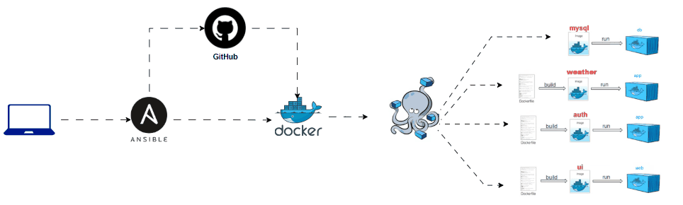

# Simple Docker Deployment for Weather App

This project provides an Ansible playbook that automates the process of deploying a weather application using Docker and Docker Compose. The playbook performs the following tasks:

- Checks if Docker, Git, and Docker Compose are installed.
- Clones the weather app repository from GitHub.
- Builds Docker images from the cloned repository.
- starts the services using Docker Compose.

## Prerequisites

Before running the playbook, ensure you have the following:

1. **Ansible**: Ansible is used for automation. Make sure it is installed on your machine. You can install Ansible by following the [official installation guide](https://docs.ansible.com/ansible/latest/installation_guide/index.html).

2. **Docker**: Docker must be installed on the target machine (referred to as `serverA` in this project). Docker is required for building and running containers. You can install Docker by following the [official Docker installation guide](https://docs.docker.com/get-docker/).

3. **Docker Compose**: Docker Compose must be installed on the target machine. Docker Compose is used for defining and running multi-container Docker applications. You can install Docker Compose by following the [official installation guide](https://docs.docker.com/compose/install/).

4. **Git**: Git should be installed on the target machine to clone the Git repository. You can install Git by following the [official Git installation guide](https://git-scm.com/book/en/v2/Getting-Started-Installing-Git).

## Project Structure

```bash
docker-deploy-tools/
├── playbook.yml
├── inventory
├── vars.yml
└── theweatherapp/
    └── docker-compose.yml
```
